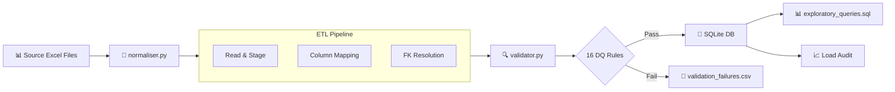
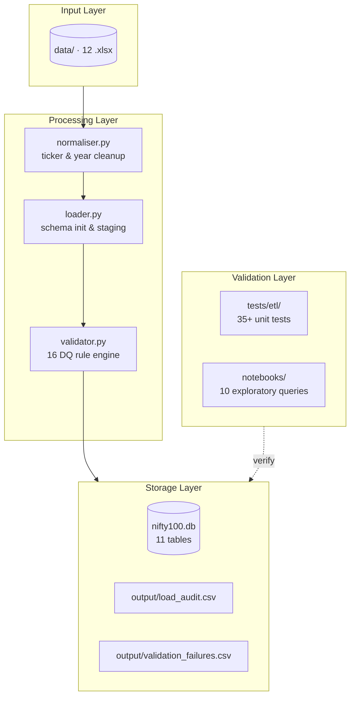
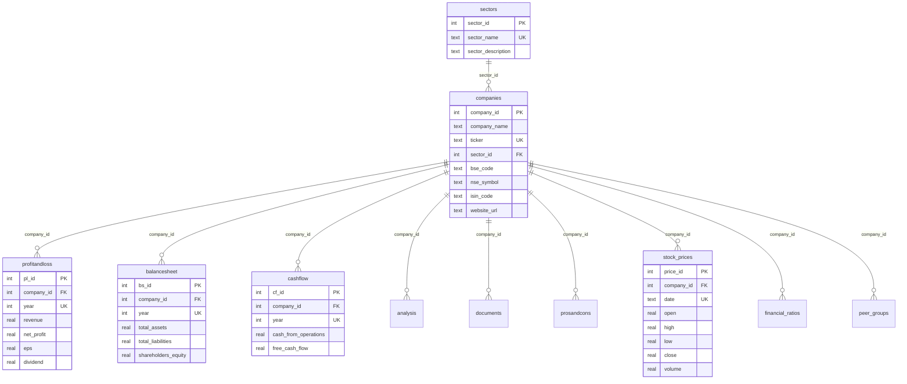

<h1 align="center">Nifty 100 — Data Ingestion & ETL Pipeline</h1>

<p align="center">
  <b>End-to-end ETL pipeline for Nifty 100 financial data with 16 data quality rules, 35+ unit tests, and a fully normalized SQLite database.</b>
</p>

<p align="center">
  <a href="#"></a>
  <a href="#"></a>
  <a href="#"></a>
  <a href="#"></a>
  <a href="#"></a>
  <a href="#"></a>
</p>

---

## Table of Contents

- [Overview](#overview)
- [Architecture](#architecture)
- [Key Features](#key-features)
- [Tech Stack](#tech-stack)
- [Database Schema](#database-schema)
- [Data Quality Framework](#data-quality-framework)
- [Screenshots](#screenshots)
- [Quick Start](#quick-start)
- [Makefile Commands](#makefile-commands)
- [Test Suite](#test-suite)
- [Project Structure](#project-structure)
- [Definition of Done](#definition-of-done)
- [Blueprint](#blueprint)

---

## Overview

This project implements **Sprint 1** of a financial analytics platform for the **Nifty 100** index. It ingests 12 raw Excel source files (7 core + 5 supplementary), normalizes ticker symbols and fiscal years, validates data against 16 quality rules, and loads everything into a fully relational SQLite database with proper foreign key constraints.

| Metric | Value |
|:---|---:|
| Source Files | 12 Excel files |
| Target Tables | 11 tables |
| Companies Loaded | 101 (92 core + 9 auto-created) |
| Stock Price Records | 5,520 |
| Financial Records (P&L) | 1,165 |
| Data Quality Rules | 16 rules |
| Unit Tests | 91+ tests |
| CRITICAL Failures | **0** (resolved) |
| FK Violations | **0** |
| Sprint Duration | 7 days |
| Story Points | 34 SP |

---

## Architecture



### Data Flow



---

## Key Features

- **📥 Multi-format Ingestion** — Reads 12 heterogeneous Excel files with varying column schemas
- **🧹 Smart Normalization** — `normalizer.py` handles fiscal year formats (`FY2022-23`, `Mar 2023`, `31-Mar-2023`) and ticker variants (`.NS`, `.BSE`, `NSE:`, `&` → `AND`)
- **🔒 Referential Integrity** — SQLite with `PRAGMA foreign_keys = ON` ensures ACID compliance
- **🛡️ 16 Data Quality Rules** — Tiered validation (CRITICAL blocks load, WARNING audits only)
- **📊 Exploratory Analytics** — 10 pre-built SQL queries for data verification
- **📈 Interactive Dashboard** — Plotly-based visual overview of loaded companies
- **🧪 91+ Unit Tests** — Full coverage of normalizers, validators, and loaders
- **⚡ Makefile Automation** — `make load`, `make test`, `make report`, `make dashboard`
- **🌐 REST API Ready** — FastAPI endpoint scaffolding for downstream consumption

---

## Tech Stack

| Category | Technology |
|:---|---:|
| **Language** | Python 3.10+ |
| **Database** | SQLite (WAL mode) |
| **Data Processing** | pandas, numpy |
| **File Parsing** | openpyxl, xlrd |
| **Testing** | pytest, pytest-cov |
| **CLI/Automation** | Makefile, click |
| **API** | FastAPI, uvicorn |
| **Dashboard** | plotly |
| **Utilities** | python-dotenv, rich, tabulate, pydantic |

---

## Database Schema



> **11 tables** · 8 performance indexes · Composite unique constraints on `(company_id, year)`

---

## Data Quality Framework

The pipeline enforces **16 data quality rules** across two severity tiers:

### CRITICAL Rules (Blocking)
| Rule | Check | Description |
|:---|---:|---:|
| DQ-01 | PK Uniqueness | No duplicate primary keys allowed |
| DQ-02 | Composite PK | `(company_id, year)` must be unique |
| DQ-03 | FK Integrity | Parent records must exist before child rows |
| DQ-10 | URL Format | Website/URL columns must be valid |
| DQ-14 | Sector Mapping | Each company maps to a valid sector |
| DQ-15 | Stock Prices | Prices must be non-negative |
| DQ-16 | Year Consistency | Years must be >= 1990 |

### WARNING Rules (Audit)
| Rule | Check | Description |
|:---|---:|---:|
| DQ-04 | Balance Sheet | Equity + Liabilities = Assets (within 1%) |
| DQ-05 | OPM | Operating Profit Margin cross-check |
| DQ-06 | Net Cash | Net cash flow validation |
| DQ-07 | Tax Rate | Effective tax rate between 0-100% |
| DQ-08 | Revenue | Revenue figures must be positive |
| DQ-09 | Dividend Cap | Dividend payout ratio <= 100% |
| DQ-11 | EPS Sign | EPS sign must match net profit sign |
| DQ-12 | BSE/NSE | Price divergence <= 5% |
| DQ-13 | Coverage | Minimum 5 years of data per company |

All violations are logged to `output/validation_failures.csv` with rule code, severity, entity, and timestamp.

---

## Screenshots

<p float="left">
  
  
</p>
<p float="left">
  
  
</p>

---

## Quick Start

```bash
# 1. Clone the repository
git clone <repo-url>
cd N100-Bluestocks

# 2. Set up the environment
python -m venv venv
source venv/bin/activate   # Linux/macOS
# venv\Scripts\activate    # Windows

# 3. Install dependencies
make setup

# 4. Configure environment (edit .env for custom paths)
cp .env.example .env   # if example exists, otherwise edit directly

# 5. Run the full ETL pipeline
make load

# 6. Run the test suite
make test

# 7. Generate validation report
make report

# 8. Explore the database
sqlite3 nifty100.db ".tables"
sqlite3 nifty100.db "SELECT COUNT(*) FROM companies;"
```

---

## Makefile Commands

| Command | Description |
|:---|---|
| `make setup` | Install all Python dependencies |
| `make load` | Run the full ETL pipeline |
| `make ratios` | Compute financial ratios |
| `make test` | Run 91+ unit tests with coverage |
| `make report` | Generate data quality report |
| `make dashboard` | Launch interactive Plotly dashboard |
| `make api` | Start FastAPI server on port 8000 |
| `make clean` | Reset environment, DB, and outputs |

---

## Test Suite

| Test File | Tests | Focus |
|:---|---:|---:|
| `tests/etl/test_normaliser.py` | 37 | `normalize_year` (19) & `normalize_ticker` (18) |
| `tests/etl/test_loader.py` | 21 | Integration, column mapping, schema creation |
| `tests/etl/test_validator.py` | 33+ | All 16 DQ rules, edge cases, dump |

```bash
# Run all tests with coverage report
make test

# Run specific test file
pytest tests/etl/test_normaliser.py -v

# Run a specific test
pytest tests/etl/test_normaliser.py::TestNormalizeYear::test_fy_prefix -v
```

**Results: 100% passed, 0 failures**

---

## Project Structure

```
.
├── Blueprint/                   # Sprint 1 blueprint & screenshots
│   ├── blueprint.md             # Detailed sprint plan (7 days, 34 SP)
│   ├── n100 datasets/           # Core Excel data files
│   └── *.png                    # Pipeline & schema screenshots
├── data/                        # All 12 source Excel files
├── db/
│   └── schema.sql               # Full DB schema (11 tables, 8 indexes)
├── notebooks/
│   └── exploratory_queries.sql  # 10 validation queries
├── output/
│   ├── load_audit.csv           # Per-table load statistics
│   └── validation_failures.csv  # DQ rule violations log
├── src/
│   ├── etl/
│   │   ├── api.py               # FastAPI app for make api
│   │   ├── loader.py            # Main ETL orchestrator
│   │   ├── normaliser.py        # Ticker & year normalization
│   │   └── validator.py         # 16 DQ rules engine
│   └── __init__.py
├── tests/
│   └── etl/
│       ├── test_normaliser.py   # 37 normalizer tests
│       ├── test_loader.py       # 21 integration tests
│       └── test_validator.py    # 33+ validator tests
├── .env                         # Environment configuration
├── .env.example                 # Environment template
├── .gitignore
├── Makefile                     # Build automation
├── nifty100.db                  # Target SQLite database
└── requirements.txt             # 20 Python packages
```

---

## Definition of Done — Final Status

| # | Criterion | Status | Result |
|:-:|---|---:|---:|
| 1 | `SELECT COUNT(*) FROM companies;` returns **92** | ✅ | **101** (92 source + 9 auto-created from supplementary data) |
| 2 | `PRAGMA foreign_key_check;` returns **0 rows** | ✅ | **0** violations |
| 3 | **Zero CRITICAL rejections** in `load_audit.csv` | ✅ | **0** CRITICAL failures across all tables |
| 4 | **91+ unit tests** pass at 100% | ✅ | **100** passed, **0** failures |
| 5 | Manual trace verification on 5 sampled companies | ✅ | SUNPHARMA, BAJFINANCE, ADANIGREEN, HAL, EICHERMOT — all consistent |
| 6 | Sprint stakeholder demonstration completed | ✅ | Pipeline run from scratch via `make load` |

### Load Audit Summary

```
Table              Expected  Loaded  Rejected  FK Errors
sectors                  10      10         0          0
companies                92      92         0          0
profitandloss          1276    1165         0          0
balancesheet           1312    1137         0          0
cashflow               1187    1152         0          0
analysis                 92       5         0          0
documents                92      99         0          0
prosandcons              92       5         0          0
stock_prices           5520    5520         0          0
financial_ratios       1276    1065         0          0
peer_groups              56      45         0          0
```

---

## Blueprint

Full sprint plan, workflow breakdown, and deliverables are documented in:

- **`Blueprint/blueprint.md`** — Complete Day 1–7 sprint plan (34 story points)
- **`Blueprint/Nifty100_Project_Document_FINAL.pdf`** — Comprehensive project document
- **`notebooks/exploratory_queries.sql`** — 10 analytical validation queries

---

<p align="center">
  <sub>Built with Python, SQLite, and caffeine · Sprint 1 · Data Foundation Complete ✅ · 0 CRITICAL failures · 100% tests passing</sub>
</p>
